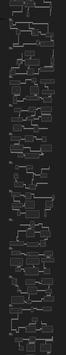
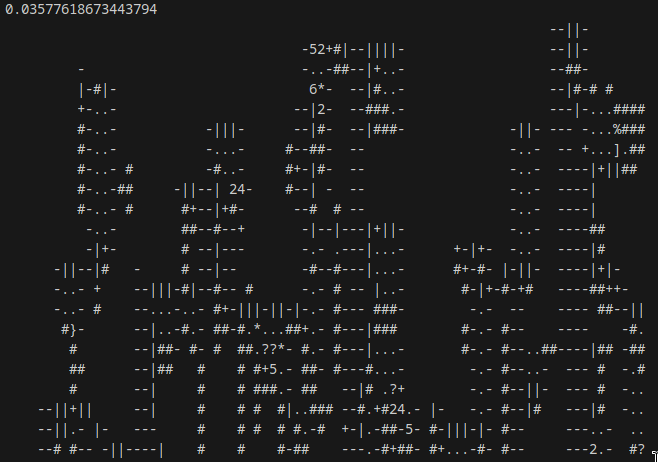
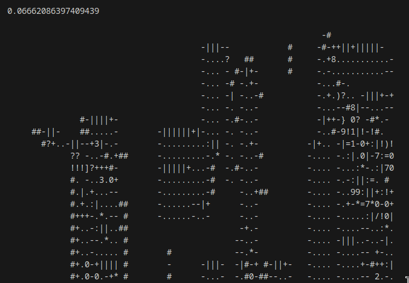
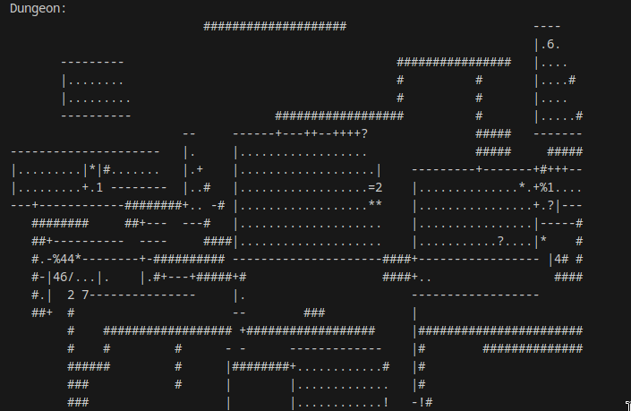
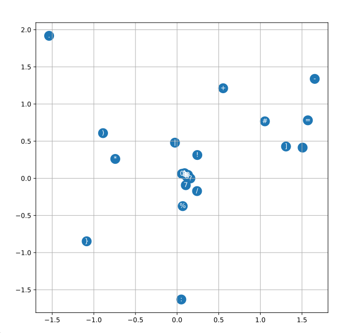
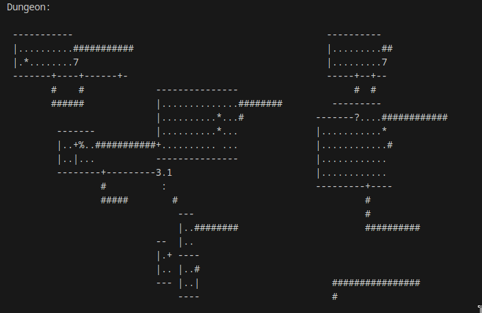

# MLP Dungeon Gen

### Day One

I've been into ai a lot recently. I did a bunch of experimenting with open weight llms, like llama, qwen, phi, etc. I've messed around with some stable diffusion image generation. I've even done some text to speech and speech to text. But the stuff that really interests me is the math and technology behind it. To try and get my feet wet, I've been reading the amazing [Deep Learning Book](https://www.deeplearningbook.org/) and watching Andrej Karpathy's Neural Networks: Zero to Hero [playlist](https://www.youtube.com/watch?v=VMj-3S1tku0&list=PLAqhIrjkxbuWI23v9cThsA9GvCAUhRvKZ&index=1). I had just finished the episode on MLPs (MultiLayer Perceptrons) and I was inspired to do my own little project. 

The idea I settled on was to do classic rougelike, ascii tile based dungeon generation. Specifically I wanted to base the generation on the original Rogue, due to it's relative simplicity. While perhaps a bit unexciting, this gave me many benefits. One, mass amounts of training data could easily be generated by modifying Rogue's open source dungeon generation algorithm. Two, the training data would be extremely uniform and easy to work with, due to existing on an ascii grid. Three, i wasn't able to find anything exactly like this with a quick google search, so I would be forced to figure out everything myself. Inspired, I quickly got to work.

To start, I'll give a brief overview of how the model works. To generate a dungeon, the model looks at a 3x3 grid of the previous tiles, and tries to guess what the next tile in the box will by. I also provide the model with the tile location, so I't can have some general spacial understanding. At first the entire map is empty. But as we slide the square along our map, tiles get generated little by little. The model is fed back it's previous tiles and slowly puts the rooms and connections together. 

To implement this, I'm following closely the design proposed in [A Neural Probabilistic Language Model](https://www.jmlr.org/papers/volume3/bengio03a/bengio03a.pdf), the paper referenced in Karpathy's video. The previous tiles and location data are each encoded into an n dimensional space, fed through a large hidden layer, and then pushed through softmax to get a probability distribution. This distribution is then sampled for the next tile. 

Before I go any further, I should probably give an overview of the dungeons we want to generate, and their common features. A typical Rogue dungeon looks like this:
```
       ------------                  -------------         ------------------   
       |..........|                  |...........|    #####+......?.....*...|   
       |......!...+##################+...........|    #    |................|   
       |..........|                  |...........+#####    |................|   
       --------+---                  ----------+--         --+---------------   
               #                               #             #                  
               ######                      #####             #########          
                    #                      #         ----------------+--------  
                 ---+-----                 #         |.......................|  
                 |.......|       ----------+------   |.......................|  
                 |...%...+###    |...............|   |.......................|  
                 |.......|  #    |...............|   |.......................|  
                 |.......|  #####+...............|   |.......................|  
                 -------+-       -----------------   -----------+-------------  
                        #                                       ####            
                        #        ------------------             ---+---------   
                        #        |................|      #######+...........|   
     ####################        |................+#######      |...........|   
     ############                |................|             |...........|   
                #                |................|             -------------   
                #################+................|                             
                                 ------------------                             
```
The boxes are the different rooms and the '#' tiles are pathways between them. The '.' tiles are ground tiles, and the '|' and '-' tiles are walls. '+' represent doors, and all other symbols are different items that can be found in the rooms. In this example '%' is food, '?' is a magical scroll, '!' is a potion, and '*' is a gem. 

Alright, enough conceptual stuff, let's get to work. My first task was generating and storing a series of Rouge levels. While ideally I would carefully extract the generation code from the Rogue source code (can be found [here](https://github.com/Davidslv/rogue)), I didn't want to spend too much time on this section. So instead I just made a small change which would write the first level to a file (instead of displaying it on the screen) and exit. I then wrote a script which started the rogue game about 10000 times and the boom, I had my training data. 

However, just having the raw dungeon outputs wasn't enough, I need to format it. This was pretty simple. I looped through each tile in each dungeon and generated one training example which would look something like this:
```
0245---.....}.
```
This string tells us that at location (02, 45) the previous 3x3 square was (the question mark is the tile we are trying to guess):
```
---
...
..?
```
In this case it is another floor tile '.'. The string is split into the input data and the expected output, separated by a '}' character. This was pretty easy to accomplish with a simple python script (written with the help of llamma3:14b).

Finally, with my formatted training data, I was able to get started on the model. My implementation started very similar to the one outlined by Karpathy with modifications for this new situation. I started with a simple encoding dimension of 2, and a hidden layer size of 100. I ran 10000 scholastic gradient descent steps with a minibatch size of 30 and in a few seconds, I was greeted by my beautiful output: 



So not great, running the model a few more times I got something a bit better, there where actually some roomish things now. 



But something was off. It didn't take me long to realize that I had mixed up my x and y in the inference, and a quick fix later we were doing much better (walls go the right direction!).



Not too bad. My next step was to increase the dimension space and hidden layer size, but before that, I wanted to take a look at the encoding space. 



There's some really interesting stuff here. All the numbers are grouped together, presumably because they represent location and not tiles. The ground tile ('.') is for away, perhaps because it is well defined as something to fill in rooms. The wall tiles are interesting not at all close to each other and a small bug has let my '}' flag character slip in. It's always cool to peak into the internals of a model. 

Anyway, my first change was to up the dimension space (now 30) and hidden layer size (now 400). I also doubled the number of trainings. This took a while longer to run, but did produce a better, less chaotic output:



At this point it was pretty late and I needed to stop, but this was by no means a bad start. There are many glaring flaws that I'll address next time, but I wanted to take a minute to appreciate how much this very simple model has managed to learn. It knows rooms are rectangularly shaped, surrounded by walls and filled with ground tiles. It knows doors go along walls and pathways always connect to doors (well, most of the time). And it almost always places items in rooms. If you squint and just glance, it looks very similar to what we are trying to achieve. And I think that's a pretty good stopping point for now.

### Day Two

And back at it again for round two. I spent a lot of time tuning the different hyperparameters. I added a simple logging systems which writes the main hyperparameters and loss result each run, for comparison. Training time seems to make the most difference, with more usually being better. I also increased the size of the block of data fed into the mlp as with only the 3x3 box there where some situations where it would be impossible for the ai to pick the right output. So it is now a sort of 5x4 box.

All of these changes helped, and now we are generating mostly plausible dungeons. 


Now there are a lot of problems here, especially in the right hand side. But the left side is almost perfect. Rectangular rooms intelligently connected with a few items scattered about. I consider this a win. 


### Concluding Thoughts

I'm very happy with how this project turned out. For how simple the model is, it was actually able to learn quite a lot, which I found very impressive. Additionally, working on this project stepped my understanding forward leaps and bounds. Watching videos and reading textbooks can teach you a lot. But I don't  think you truly learn until you actually implement something. I'd like to revisit this project one day with the same training data, but with a different model architecture, and see what effect that has. So much to do, so little time. Maybe one day I can make an AI model which gives me back some time x)