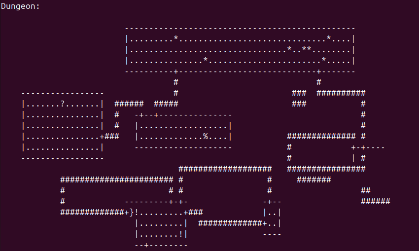

# Dungeon Gen (AI Ascii Dungeon Generation)

### Overview
This is a simple MLP (MultiLayer Perceptrons) which generates ascii dungeons like the one in the original [Rogue](https://en.wikipedia.org/wiki/Rogue_(video_game)). Inspired by Andrej Karpathy's Neural Networks: Zero to Hero [playlist](https://www.youtube.com/watch?v=VMj-3S1tku0&list=PLAqhIrjkxbuWI23v9cThsA9GvCAUhRvKZ&index=1).

### Running
Should run on any system with Python3 and PyTorch. Will be very slow without a GPU.

### Checkout Blog.md